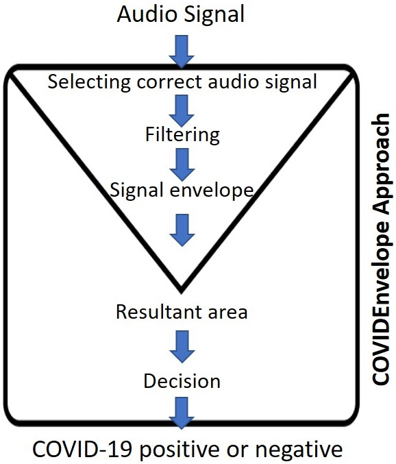

## CovidEnvelop Implementation



## Dependencies
* librosa
* pylab
* audio2numpy
* signal_envelope

## Downloading datasets
To get Russian dataset:

```bash
!git clone https://github.com/covid19-cough/dataset.git\
```
## Training
```bash
python train.py
```

## Citation
If you find this work useful for your research, please cite [paper](https://www.medrxiv.org/content/10.1101/2021.04.16.21255630v1):
```
@unknown{unknown,
author = {Hossain, Md and Uddin, Md and Yang,Yan and Ahmed, Khandaker},
year = {2021},
month = {04},
pages = {},
title = {CovidEnvelope: A Fast Automated Approach to Diagnose COVID-19 from Cough Signals},
doi = {10.1101/2021.04.16.21255630}
}
```
